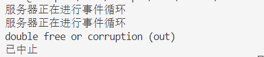
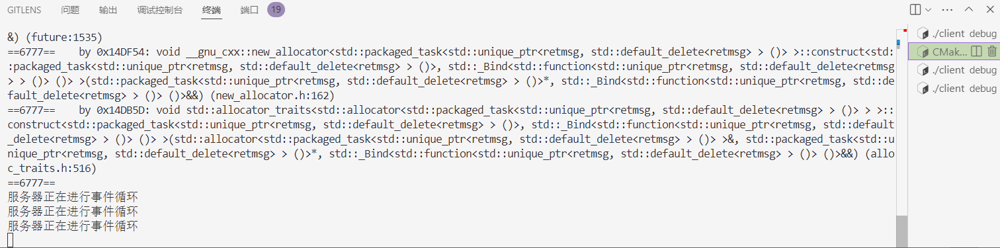

# 框架思路
    server初始化后调用eventloop()开启循环。每次处理两种事

## 1. 处理新连接。
    先调用网络io模块的deal_with_newconn()，处理新连接。然后调用自己的add_unlogin_user()，将新连接存储在unlogin_map中

## 2. 处理客户端的读事件。
    首先，以生成任务为方向考虑，可以分为三部分：读任务 处理任务 写任务。

### - 读任务
    主要内容为：从产生就绪事件的套接字的队列中，取出套接字，从中读取数据，然后封装成任务，交给线程池，然后将返回结果也就是future放入任务包装模块的队列中

    具体为：event_loop中生成一个队列，将这个队列传入到任务包装模块

### - 处理任务
    主要内容为：从线程池取出任务，执行任务。

### - 写任务
    主要内容为：从队列中取出future，等待结果，然后将结果写入到套接字中。

    具体实现：在任务包装模块中设计一个future队列，这个队列里存放处理任务的结果，然后写任务就是从这个队列中取出结果，然后写入到套接字里。

# 各个模块的具体功能
## 网络io模块
    - 发送接收数据。传入user，通过user的socket，发送接收数据。
    - 处理新连接。

## 消息分析模块
    - 解析消息。传入消息，解析消息，返回解析好的消息放入任务包装所需的基础信息结构体中。
    
## 任务包装模块
    - 生成任务。传入基础信息结构体，根据基础信息，将其与对应的处理函数打包，生成任务
    - 取出任务。从任务队列中取出任务，返回任务。

## 线程池模块
    - 初始化线程池。初始化线程池，创建线程，放入线程池。
    - 执行任务。传入任务，执行任务。
    - 销毁线程池。销毁线程池，销毁线程。

## 数据库模块
    - 初始化数据库。初始化数据库，创建数据库，创建表。

# 问题
### 1. 在taskpakcage中的login_handle函数中，登录成功后需要将username和socket放入到server的login_map中，但是login_map是server的成员变量. 怎么解决？
    解决方法：使用静态函数，或者使用bind绑定一个函数传递给taskpackage，在login_handle中调用这个函数。或者传入成员函数函数指针。
### 2. 在login_handle中，即使username和password都正确，还要验证是否以登录，即在server的login_map中是否存在username。
    解决办法：server提供一个函数，用于验证是否以登录。使用bind包装一个函数传给taskpackage。依次类推，在taskpackage中，使用bind绑定一个函数，传入server的成员函数指针，在login_handle中调用这个函数。 
### 3. 多线程读写套接字问题。
经过我不懈努力，得出结论：不应该用多线程同时读写套接字，因为这个方案从设计上就是错误的。

    读：虽说et模式可以保证同一时间内只有一个线程读取套接字，然而，一次读取很可能会读取到多条消息，那么一个线程岂不是要处理多条消息，这个会很麻烦。因为如果这样那么networkio的recv函数就要返回一个消息vector了。而我们希望每次读取只返回一条消息，然鹅et模式要求每次必须读取全部消息，这就与我们的想法背道而驰了。既然不适用et模式，那就只能加锁了。可是，这样就会导致多个线程同时读写套接字，这是错误设计。

    写：详情参考：https://www.zhihu.com/question/56899596。
    解决办法：专门使用一个读线程，一个写线程。读线程负责从套接字中读取数据，然后将数据放入任务包装模块的队列中。写线程负责从任务包装模块的队列中取出任务，然后将任务写入到套接字中。这样就可以保证读写套接字的线程安全。

# 出现的bug
## 1. 过了一遍event_loop后报错double free or corruption。
### - 如下图：

### - 解决过程
#### 分析：
    报错意为多重释放或者损坏。也就是内存管理出了问题，要使用使用valgrind检查。
    valgrind命令为：valgrind --leak-check=full --show-leak-kinds=all --track-origins=yes ./my_server。

    结果为：
    ==6777== Memcheck, a memory error detector
    ==6777== Copyright (C) 2002-2017, and GNU GPL'd, by Julian Seward et al.
    ==6777== Using Valgrind-3.18.1 and LibVEX; rerun with -h for copyright info
    ==6777== Command: ./my_server
    ==6777== 
    服务器正在进行事件循环
    ==6777== Thread 11:
    ==6777== Invalid free() / delete / delete[] / realloc()
    ==6777==    at 0x484BB6F: operator delete(void*, unsigned long) (in /usr/libexec/valgrind/vgpreload_memcheck-amd64-linux.so)
    ==6777==    by 0x11393D: std::default_delete<abstractmsg>::operator()(abstractmsg*) const (unique_ptr.h:85)
    ==6777==    by 0x112273: std::unique_ptr<abstractmsg, std::default_delete<abstractmsg> >::~unique_ptr() (unique_ptr.h:361)
    ==6777==    by 0x144167: taskpackage::generate_task(std::unique_ptr<abstractmsg, std::default_delete<abstractmsg> >)::{lambda()#6}::operator()() (taskpackage.cpp:52)
    ==6777==    by 0x14788C: std::unique_ptr<retmsg, std::default_delete<retmsg> > std::__invoke_impl<std::unique_ptr<retmsg, std::default_delete<retmsg> >, taskpackage::generate_task(std::unique_ptr<abstractmsg, std::default_delete<abstractmsg> >)::{lambda()#6}&>(std::__invoke_other, taskpackage::generate_task(std::unique_ptr<abstractmsg, std::default_delete<abstractmsg> >)::{lambda()#6}&) (invoke.h:61)
#### 得出原因为：
    问题出在 std::unique_ptr<abstractmsg> 的析构函数调用时，尝试释放一个已经被释放的内存块。具体来说，std::unique_ptr<abstractmsg> 在 taskpackage::generate_task 函数中被多次释放，导致了 Invalid free() 错误。

    也就是关于std::unique_ptr<abstractmsg>的那几个函数中没有使用转移语义。实际发现是taskpackage中login_handle等函数的形参列表中的问题

### 解决方法
    使用转移的方式，也就是使用std::move()。

### 修改后结果
    服务器正常运行。

# 消息格式
### 登录
    - login。
    {
        "type": "login",
        "data": {
                "username": "alice",
                "password": "password123"
                }
    }

### 注册
    - register
    {
        "type": "register",
        "data": {
                "username": "alice",
                "password": "password123"
                }
    }

### 聊天
    - chat
    {
        "type": "chat",
        "data": {
                "content": "Hello, world!",
                "receiver": "bob"
                }
    }

### 接收
    - recv
    {
        "type": "recv"
    }

### 返回
    - ret
    {
        "type": "ret"
    }

# redis

### 用户会话管理:
    Redis可以用来存储用户的会话信息，如用户ID、用户名、状态（在线/离线）等。由于Redis是内存数据库，它能够快速地读写数据，适合处理高并发的场景。
    可以使用哈希表（Hashes）来存储每个用户的详细信息，集合（Sets）来跟踪在线用户列表。
### 房间与成员管理:
    使用集合或有序集合（Sorted Sets）来维护聊天室中的成员列表。这可以帮助快速查找某个用户是否属于特定的聊天室。
    如果需要按加入时间排序，可以使用有序集合，并将加入时间作为分数值。
### 消息队列:
    Redis的发布/订阅模式（Pub/Sub）非常适合用于实现即时消息传递。当一个用户发送消息时，服务器可以将消息发布到一个频道，所有订阅该频道的客户端都可以接收到这条消息。
    列表（Lists）也可以用作简单的消息队列，通过LPUSH和RPOP命令来实现先进先出的消息处理。
### 持久化聊天记录:
    虽然Redis主要用于内存缓存，但也可以配置为持久化存储，这样就可以保存聊天记录供后续查询。
    可以使用字符串（Strings）、列表或者哈希表来存储聊天记录，并定期将这些数据持久化到磁盘。
### 计数器和统计:
    使用计数器（比如INCR/DECR命令）来追踪用户发送的消息数量，或者聊天室内的活跃度等指标。
    对于一些实时统计数据，可以利用Redis的高性能特性来进行实时计算。
### 缓存:
    Redis可以用来缓存频繁访问的数据，减少对后端数据库的压力，提高响应速度。
### 分布式锁:
    在多实例部署的情况下，可能需要某种形式的分布式锁来保证某些操作的原子性。Redis支持这样的功能，可以防止多个客户端同时修改同一资源。
### 延迟任务:
    使用Redis的Sorted Set可以实现延迟任务队列，例如，如果需要在一段时间后向用户发送提醒或执行其他动作。
    为了在C++项目中使用Redis，你需要选择一个合适的C++ Redis客户端库，如hiredis、cpp_redis等。这些库提供了连接Redis服务器的功能，并封装了Redis命令的调用接口，使得在C++程序中使用Redis变得简单直接。
