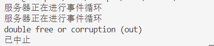
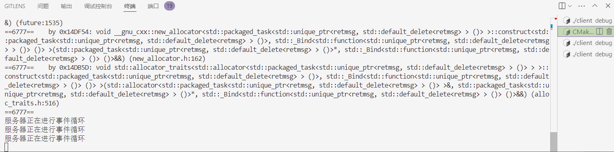

# 出现的bug
## 1. 过了一遍event_loop后报错double free or corruption。
### - 如下图：



### - 解决过程
#### 分析：
    报错意为多重释放或者损坏。也就是内存管理出了问题，要使用使用valgrind检查。
    valgrind命令为：valgrind --leak-check=full --show-leak-kinds=all --track-origins=yes ./my_server。

    结果为：
    ==6777== Memcheck, a memory error detector
    ==6777== Copyright (C) 2002-2017, and GNU GPL'd, by Julian Seward et al.
    ==6777== Using Valgrind-3.18.1 and LibVEX; rerun with -h for copyright info
    ==6777== Command: ./my_server
    ==6777== 
    服务器正在进行事件循环
    ==6777== Thread 11:
    ==6777== Invalid free() / delete / delete[] / realloc()
    ==6777==    at 0x484BB6F: operator delete(void*, unsigned long) (in /usr/libexec/valgrind/vgpreload_memcheck-amd64-linux.so)
    ==6777==    by 0x11393D: std::default_delete<abstractmsg>::operator()(abstractmsg*) const (unique_ptr.h:85)
    ==6777==    by 0x112273: std::unique_ptr<abstractmsg, std::default_delete<abstractmsg> >::~unique_ptr() (unique_ptr.h:361)
    ==6777==    by 0x144167: taskpackage::generate_task(std::unique_ptr<abstractmsg, std::default_delete<abstractmsg> >)::{lambda()#6}::operator()() (taskpackage.cpp:52)
    ==6777==    by 0x14788C: std::unique_ptr<retmsg, std::default_delete<retmsg> > std::__invoke_impl<std::unique_ptr<retmsg, std::default_delete<retmsg> >, taskpackage::generate_task(std::unique_ptr<abstractmsg, std::default_delete<abstractmsg> >)::{lambda()#6}&>(std::__invoke_other, taskpackage::generate_task(std::unique_ptr<abstractmsg, std::default_delete<abstractmsg> >)::{lambda()#6}&) (invoke.h:61)
#### 得出原因为：
    问题出在 std::unique_ptr<abstractmsg> 的析构函数调用时，尝试释放一个已经被释放的内存块。具体来说，std::unique_ptr<abstractmsg> 在 taskpackage::generate_task 函数中被多次释放，导致了 Invalid free() 错误。

    也就是关于std::unique_ptr<abstractmsg>的那几个函数中没有使用转移语义。实际发现是taskpackage中login_handle等函数的形参列表中的问题

### 解决方法
    使用转移的方式，也就是使用std::move()。

### 修改后结果
    服务器正常运行。


## 2. 死锁了
     Id   Target Id                                    Frame 
    1    Thread 0x7ffff6d080c0 (LWP 1386) "server2.0" 0x00007ffff7b6fe2e in epoll_wait (epfd=3, events=0x7fffffffa5a0, maxevents=1024, timeout=-1) at ../sysdeps/unix/sysv/linux/epoll_wait.c:30
    2    Thread 0x7ffff6d04640 (LWP 1433) "server2.0" __futex_abstimed_wait_common64 (private=0, cancel=true, abstime=0x0, op=393, expected=0, futex_word=0x55555560d398) at ./nptl/futex-internal.c:57
    3    Thread 0x7ffff6503640 (LWP 1434) "server2.0" socketManager::get_updated_socket_send_vec (this=0x0) at /home/creeper/code/c++2.0/onlinetalk/server/server2.0/socketManager/socketManager.cpp:139
    * 4    Thread 0x7ffff5d02640 (LWP 1435) "server2.0" ___pthread_mutex_lock (mutex=0x78) at ./nptl/pthread_mutex_lock.c:80
    5    Thread 0x7ffff5501640 (LWP 1436) "server2.0" 0x00007ffff7b2f7f8 in __GI___clock_nanosleep (clock_id=clock_id@entry=0, flags=flags@entry=0, req=0x7ffff5500590, rem=0x7ffff5500590) at ../sysdeps/unix/sysv/linux/clock_nanosleep.c:78
    6    Thread 0x7ffff4d00640 (LWP 1437) "server2.0" ___pthread_mutex_lock (mutex=0x1d0) at ./nptl/pthread_mutex_lock.c:80
    7    Thread 0x7ffff44ff640 (LWP 1438) "server2.0" __futex_abstimed_wait_common64 (private=0, cancel=true, abstime=0x0, op=393, expected=0, futex_word=0x555555616730) at ./nptl/futex-internal.c:57
    8    Thread 0x7ffff3cfe640 (LWP 1439) "server2.0" __futex_abstimed_wait_common64 (private=0, cancel=true, abstime=0x0, op=393, expected=0, futex_word=0x555555616730) at ./nptl/futex-internal.c:57
    9    Thread 0x7ffff34fd640 (LWP 1440) "server2.0" __futex_abstimed_wait_common64 (private=0, cancel=true, abstime=0x0, op=393, expected=0, futex_word=0x555555616730) at ./nptl/futex-internal.c:57
    10   Thread 0x7ffff2cfc640 (LWP 1441) "server2.0" __futex_abstimed_wait_common64 (private=0, cancel=true, abstime=0x0, op=393, expected=0, futex_word=0x555555616730) at ./nptl/futex-internal.c:57
    11   Thread 0x7ffff24fb640 (LWP 1442) "server2.0" __futex_abstimed_wait_common64 (private=0, cancel=true, abstime=0x0, op=393, expected=0, futex_word=0x555555616730) at ./nptl/futex-internal.c:57

### 解决了
注意到线程3的socketManager::get_updated_socket_send_vec (this=0x0)传入的this指针为空，原来是socket_manager没有初始化


在设计一个基于C++的即时通讯软件时，客户端和服务端之间的消息类型需要覆盖用户管理、好友管理和群组管理等多个方面。以下是针对这些类别的更全面的消息类型补充说明： 

### 用户类消息

1. **登录**:
   - 用户提供用户名和密码进行身份验证。
   - 可能还包括设备信息、IP地址等用于安全检查。

2. **注册**:
   - 创建新用户账户，包括基本信息如用户名、密码、邮箱或手机号码。
   - 可以包含额外的验证步骤，比如邮箱验证或手机验证码。

3. **注销**:
   - 从当前会话中登出用户。
   - 清除所有活跃的会话令牌。

4. **修改个人信息**:
   - 更新用户的个人资料，如昵称、头像、状态消息等。

5. **找回/重置密码**:
   - 通过邮箱或手机号发送密码重置链接或验证码。

6. **在线状态变更**:
   - 用户上线或离线的通知。

7. **获取用户信息**:
   - 请求查看特定用户的公开信息。

8. **删除账户**:
   - 用户请求永久删除其账户及所有相关数据。

{
    "type": "user",
    "action": "login",
    "username": "user123",
    "password": "pass123"
}

### 好友类消息

1. **添加好友**:
   - 向另一个用户发送加为好友的请求。
   - 可以附带一条个性化的邀请信息。

2. **接受/拒绝好友请求**:
   - 对收到的好友请求做出响应。

3. **删除好友**:
   - 从好友列表中移除某个联系人。

4. **搜索好友**:
   - 根据用户名或其他标识符查找潜在的好友。

5. **给好友发消息**:
   - 发送文本消息、图片、文件等。

6. **查看好友状态**:
   - 查询好友的在线状态或最近活动时间。

7. **屏蔽/取消屏蔽好友**:
   - 阻止接收某位好友的消息或解除屏蔽。

8. **查看好友列表**:
   - 获取自己的好友列表。

9. **设置好友备注名**:
   - 为好友设定一个易于识别的名字。

### 群组类消息

1. **创建群组**:
   - 创建一个新的聊天群，并指定初始成员。

2. **加入群组**:
   - 用户申请加入现有的群组，可能需要管理员批准。

3. **退出群组**:
   - 用户自愿离开一个群组。

4. **注销群组**:
   - 群主解散群组，或者因不活跃等原因系统自动解散。

5. **邀请成员进群**:
   - 群内成员可以邀请其他人加入群聊。

6. **踢出成员**:
   - 管理员移除群内的某个成员。

7. **设置管理员**:
   - 提升或降低群内成员的权限等级。

8. **更改群组信息**:
   - 修改群名称、描述等基本信息。

9. **群组公告**:
   - 发布或更新群组公告。

10. **群组消息提醒**:
    - 设置是否接收来自该群组的通知。

11. **查看群组成员列表**:
    - 获取群组中的所有成员及其角色（如管理员、普通成员）。

12. **群组历史记录**:
    - 查看群聊的历史消息记录。

13. **设置群组隐私**:
    - 控制谁可以看到群组以及谁能加入群组。

每种消息类型都应有相应的JSON格式定义，以便于解析和处理。此外，还需要考虑安全性因素，例如使用HTTPS协议传输敏感信息，以及对敏感操作（如修改密码、删除账户）增加额外的身份验证步骤。

在设计一个全面的即时通讯软件时，除了用户管理、好友管理和群组管理之外，还有许多其他类型的消息和功能可以考虑。以下是一些额外的消息类型和服务功能，这些可以进一步丰富你的应用程序：

### 通知类消息

1. **系统通知**:
   - 更新通知：应用更新可用。
   - 服务状态变更：如服务器维护或网络问题等。

2. **事件提醒**:
   - 生日提醒：好友生日即将到来。
   - 会议提醒：即将开始的会议或活动。

3. **消息状态通知**:
   - 消息已读/未读状态。
   - 消息发送成功/失败的通知。

4. **联系人状态变化**:
   - 联系人上线/离线通知。
   - 联系人个人信息更新（例如昵称更改）。

### 文件传输类消息

1. **文件上传**:
   - 发送图片、视频、文档等文件。
   - 可以包含文件预览信息（如缩略图、文件名、大小）。

2. **文件下载请求**:
   - 请求下载某个文件。
   - 包含文件标识符、下载链接等信息。

3. **文件接收确认**:
   - 确认收到文件。
   - 可能包括文件完整性检查的信息。

### 媒体共享类消息

1. **语音消息**:
   - 发送和接收语音片段。
   - 支持播放控制（暂停、快进、后退）。

2. **视频通话**:
   - 发起视频通话邀请。
   - 接受或拒绝视频通话。
   - 视频流数据传输。

3. **屏幕共享**:
   - 开始或结束屏幕共享会话。
   - 控制权转移（允许参与者控制屏幕）。

### 交互式消息

1. **投票/问卷**:
   - 创建投票或问卷。
   - 投票选项及结果统计。

2. **位置分享**:
   - 分享当前位置。
   - 查看好友的位置（需要权限）。

3. **游戏邀请**:
   - 邀请好友参与在线游戏。
   - 游戏成绩分享。

### 安全与隐私

1. **两步验证**:
   - 启用或禁用两步验证。
   - 提供一次性验证码。

2. **隐私设置**:
   - 更改个人资料可见性。
   - 设置谁可以看到自己的在线状态。

3. **举报和屏蔽**:
   - 举报不当内容或行为。
   - 屏蔽特定用户的骚扰消息。

### 社交功能

1. **点赞和评论**:
   - 对消息或帖子进行点赞。
   - 发表评论。

2. **分享**:
   - 分享消息到其他平台或群组。
   - 分享外部链接或内容。

3. **动态/朋友圈**:
   - 发布个人动态。
   - 查看好友的动态。

### 个性化设置

1. **主题和皮肤**:
   - 更换应用界面的主题。
   - 自定义背景图片。

2. **通知偏好**:
   - 设置哪些类型的活动触发通知。
   - 选择通知的声音或震动模式。

3. **快捷回复**:
   - 设置常用的快捷回复文本。

### 数据同步与备份

1. **聊天记录同步**:
   - 在不同设备间同步聊天记录。

2. **数据备份**:
   - 手动或自动备份聊天记录和个人资料。

3. **恢复数据**:
   - 从备份中恢复数据。

### 其他

1. **语言切换**:
   - 支持多语言界面。
   - 动态切换应用语言。

2. **帮助和支持**:
   - 提供帮助文档或常见问题解答。
   - 提交支持请求。

3. **反馈提交**:
   - 用户可以提交关于应用的意见或建议。

通过整合以上多种类型的消息和服务，你可以构建一个功能丰富且用户体验良好的即时通讯工具。每种消息类型都应有相应的JSON格式定义，并确保在客户端和服务器之间安全地传输数据。


# 模块设计
### 消息解析模块
使用策略模式加抽象工厂模式，实现消息解析模块。前者是根据不同类型不同动作对应的处理策略，后者是根据不同类型不同动作生成对应的策略。


# 网络io模块

## 收发设计
在网络I/O模块中，如果需要同时处理文本消息、图片、文件等不同类型的数据，可以设计一个通用的接口来处理这些数据。通常的做法是将所有数据视为二进制流，并使用统一的数据结构来表示这些数据。这样可以简化发送和接收逻辑，并且能够处理各种类型的数据。

### 设计思路

1. **数据结构**：
   - 使用`std::vector<uint8_t>`（或`std::vector<char>`）来存储二进制数据。
   - 可以定义一个枚举类型来标识数据的类型（如文本、图片、文件等）。
   - 使用一个结构体或类来封装数据类型和数据内容。

2. **发送函数**：
   - 发送函数接受一个包含数据类型和数据内容的结构体或类作为参数。
   - 根据数据类型进行必要的编码或包装（例如，添加头部信息）。
   - 将数据通过网络发送出去。

3. **接收函数**：
   - 接收函数从网络读取数据，并解析出数据类型和数据内容。
   - 根据数据类型进行解码或解包。
   - 返回解析后的数据。

### 示例代码

以下是一个简单的示例，展示了如何设计这样的网络I/O模块。

#### 数据结构

```cpp
#include <vector>
#include <cstdint>
#include <string>

// 定义数据类型枚举
enum class DataType {
    TEXT,
    IMAGE,
    FILE
};

// 定义数据结构
struct DataPacket {
    DataType type;
    std::vector<uint8_t> data;

    // 构造函数
    DataPacket(DataType type, const std::vector<uint8_t>& data) : type(type), data(data) {}
};
```

#### 发送函数

```cpp
#include <sys/socket.h>
#include <unistd.h>
#include <cstring>

void send_data(int socket_fd, const DataPacket& packet) {
    // 创建一个临时缓冲区来存储数据类型和数据
    std::vector<uint8_t> buffer;
    
    // 添加数据类型
    uint8_t type_byte = static_cast<uint8_t>(packet.type);
    buffer.push_back(type_byte);

    // 添加数据长度
    uint32_t length = htonl(static_cast<uint32_t>(packet.data.size()));
    buffer.insert(buffer.end(), reinterpret_cast<uint8_t*>(&length), reinterpret_cast<uint8_t*>(&length) + sizeof(length));

    // 添加数据内容
    buffer.insert(buffer.end(), packet.data.begin(), packet.data.end());

    // 发送数据
    ssize_t bytes_sent = send(socket_fd, buffer.data(), buffer.size(), 0);
    if (bytes_sent == -1) {
        perror("send");
    } else if (static_cast<size_t>(bytes_sent) != buffer.size()) {
        std::cerr << "Partial send: " << bytes_sent << " of " << buffer.size() << " bytes" << std::endl;
    } else {
        std::cout << "Sent: " << buffer.size() << " bytes" << std::endl;
    }
}
```

#### 接收函数

```cpp
#include <sys/socket.h>
#include <unistd.h>
#include <cstring>

DataPacket receive_data(int socket_fd) {
    // 读取数据类型
    uint8_t type_byte;
    ssize_t bytes_received = recv(socket_fd, &type_byte, 1, 0);
    if (bytes_received <= 0) {
        perror("recv");
        return DataPacket(DataType::TEXT, {}); // 返回默认值
    }

    // 读取数据长度
    uint32_t length;
    bytes_received = recv(socket_fd, &length, sizeof(length), 0);
    if (bytes_received <= 0) {
        perror("recv");
        return DataPacket(DataType::TEXT, {}); // 返回默认值
    }
    length = ntohl(length);

    // 读取数据内容
    std::vector<uint8_t> data(length);
    bytes_received = recv(socket_fd, data.data(), length, 0);
    if (bytes_received <= 0) {
        perror("recv");
        return DataPacket(DataType::TEXT, {}); // 返回默认值
    }

    // 返回数据包
    return DataPacket(static_cast<DataType>(type_byte), data);
}
```

### 总结

- **数据结构**：使用`DataPacket`结构体来封装数据类型和数据内容。
- **发送函数**：`send_data`函数将数据类型、数据长度和数据内容打包后发送。
- **接收函数**：`receive_data`函数从网络读取数据，并解析出数据类型和数据内容。

这种设计方式使得网络I/O模块能够灵活地处理多种类型的数据，而不需要为每种数据类型单独编写发送和接收函数。通过这种方式，你可以更方便地扩展功能，支持更多的数据类型。


## 消息设计
设计消息体时，需要考虑消息的结构、内容以及如何在系统中传递和处理。一个好的消息体设计应该能够清晰地表达消息的内容，同时便于扩展和维护。以下是一些设计消息体时可以遵循的原则和建议：

### 1. **定义消息结构**
首先，你需要定义消息的基本结构。这通常包括消息头和消息体两部分。

- **消息头**：包含一些元数据，如消息类型、发送者、接收者、时间戳、序列号等。
- **消息体**：包含实际的消息内容，根据消息类型的不同而不同。

### 2. **使用标准库或第三方库**
可以使用C++标准库中的`std::variant`（C++17及以上）或第三方库如`protobuf`、`flatbuffers`等来定义消息体。这些工具可以帮助你更方便地处理不同类型的消息。

### 3. **消息类型枚举**
定义一个枚举类型来表示不同的消息类型，这样可以在消息头中明确标识消息的具体类型。

```cpp
enum class MessageType {
    Text,
    Image,
    Command,
    // 其他消息类型...
};
```

### 4. **消息头结构**
定义一个结构体来表示消息头，包含必要的元数据。

```cpp
#include <string>
#include <chrono>

struct MessageHeader {
    MessageType type;
    std::string sender;
    std::string receiver;
    std::chrono::system_clock::time_point timestamp;
    uint64_t sequenceNumber;  // 消息序列号
};
```

### 5. **消息体结构**
定义一个联合体（Union）或变体（Variant）来表示消息体，支持不同类型的消息内容。

```cpp
#include <string>
#include <vector>
#include <variant>

// 定义具体的消息内容
struct TextContent {
    std::string text;
};

struct ImageContent {
    std::vector<uint8_t> imageData;
};

struct CommandContent {
    std::string command;
    std::vector<std::string> parameters;
};

// 使用std::variant来表示不同类型的消息体
using MessageBody = std::variant<TextContent, ImageContent, CommandContent>;

// 或者使用std::any（C++17及以上）
// using MessageBody = std::any;
```

### 6. **完整的消息结构**
将消息头和消息体组合成一个完整的消息结构。

```cpp
struct Message {
    MessageHeader header;
    MessageBody body;

    // 构造函数
    Message(MessageType type, const std::string& sender, const std::string& receiver, MessageBody body)
        : header{type, sender, receiver, std::chrono::system_clock::now(), 0}, body(body) {}

    // 序列化和反序列化方法（如果需要）
    // void serialize(std::ostream& out) const;
    // static Message deserialize(std::istream& in);
};
```

### 7. **消息处理**
定义一个消息处理接口，用于处理不同类型的消息。

```cpp
class MessageHandler {
public:
    virtual ~MessageHandler() = default;
    virtual void Handle(const Message& message) = 0;
};

// 具体的消息处理器
class TextMessageHandler : public MessageHandler {
public:
    void Handle(const Message& message) override {
        if (std::holds_alternative<TextContent>(message.body)) {
            auto& content = std::get<TextContent>(message.body);
            std::cout << "Handling text message: " << content.text << std::endl;
        } else {
            std::cerr << "Unexpected message type for TextMessageHandler" << std::endl;
        }
    }
};

class ImageMessageHandler : public MessageHandler {
public:
    void Handle(const Message& message) override {
        if (std::holds_alternative<ImageContent>(message.body)) {
            auto& content = std::get<ImageContent>(message.body);
            std::cout << "Handling image message with size: " << content.imageData.size() << std::endl;
        } else {
            std::cerr << "Unexpected message type for ImageMessageHandler" << std::endl;
        }
    }
};

class CommandMessageHandler : public MessageHandler {
public:
    void Handle(const Message& message) override {
        if (std::holds_alternative<CommandContent>(message.body)) {
            auto& content = std::get<CommandContent>(message.body);
            std::cout << "Handling command: " << content.command << " with parameters: ";
            for (const auto& param : content.parameters) {
                std::cout << param << " ";
            }
            std::cout << std::endl;
        } else {
            std::cerr << "Unexpected message type for CommandMessageHandler" << std::endl;
        }
    }
};
```

### 8. **消息注册表**
使用注册表来管理不同类型的处理器。

```cpp
#include <unordered_map>
#include <memory>

using HandlerRegistry = std::unordered_map<MessageType, std::shared_ptr<MessageHandler>>;

class MessageRegistry {
private:
    HandlerRegistry registry;

public:
    void RegisterHandler(MessageType type, std::shared_ptr<MessageHandler> handler) {
        registry[type] = handler;
    }

    void ProcessMessage(const Message& message) {
        auto it = registry.find(message.header.type);
        if (it != registry.end()) {
            it->second->Handle(message);
        } else {
            std::cerr << "No handler found for message type: " << static_cast<int>(message.header.type) << std::endl;
        }
    }
};

int main() {
    MessageRegistry registry;

    // 注册处理器
    registry.RegisterHandler(MessageType::Text, std::make_shared<TextMessageHandler>());
    registry.RegisterHandler(MessageType::Image, std::make_shared<ImageMessageHandler>());
    registry.RegisterHandler(MessageType::Command, std::make_shared<CommandMessageHandler>());

    // 创建并处理消息
    Message textMsg(MessageType::Text, "sender", "receiver", TextContent{"Hello, world!"});
    Message imageMsg(MessageType::Image, "sender", "receiver", ImageContent{{1, 2, 3, 4, 5}});
    Message commandMsg(MessageType::Command, "sender", "receiver", CommandContent{"start", {"param1", "param2"}});

    registry.ProcessMessage(textMsg);
    registry.ProcessMessage(imageMsg);
    registry.ProcessMessage(commandMsg);

    return 0;
}
```

### 总结
- **消息头** 包含元数据，帮助识别和处理消息。
- **消息体** 使用 `std::variant` 或其他方式来表示不同类型的消息内容。
- **消息处理** 通过接口和具体实现来处理不同类型的消息。
- **消息注册表** 用来管理和查找消息处理器。

这样的设计既灵活又可扩展，能够适应多种消息类型和处理逻辑。

文本消息在聊天系统中可以进一步细分为多种类型，除了用户消息（如登录、注册、个人信息更新等）和聊天消息（如私聊、群聊）之外，还可以包括以下几种类型的消息：

### 1. 系统通知
- **系统公告**：系统发布的公告或重要通知，例如服务更新、维护计划、新功能发布等。
- **提醒**：提醒用户未读消息、活动邀请、日程提醒、生日提醒等。
- **状态更新**：用户的在线状态变更通知，如上线、离线、忙碌等。

### 2. 控制消息
- **加入/离开群组**：用户加入或离开群组时的通知。
- **踢出成员**：管理员将某个成员从群组中移除时的通知。
- **权限变更**：用户角色或权限变更的通知，如成为管理员、被取消管理员权限等。
- **设置变更**：更改群组设置（如名称、描述、隐私设置）的通知。

### 3. 交互消息
- **好友请求**：用户向其他用户发送的好友请求。
- **好友确认**：接受或拒绝好友请求的通知。
- **文件传输**：用户之间传输文件的通知。
- **位置共享**：用户分享地理位置信息的消息。
- **联系人分享**：用户分享其他用户的联系信息。
- **链接分享**：用户分享网页链接或其他资源链接。

### 4. 服务消息
- **验证码**：用于验证用户身份的一次性验证码。
- **密码重置**：用户请求重置密码时发送的临时链接或验证码。
- **账户激活**：用户注册后需要激活账户时发送的链接或验证码。
- **订阅通知**：用户订阅某些内容或服务后的通知。

### 5. 交易消息
- **支付通知**：用户进行支付操作后的通知，如充值成功、购买成功等。
- **订单状态**：订单处理状态的通知，如订单创建、发货、配送、完成等。
- **退款通知**：用户申请退款后的处理结果通知。

### 6. 互动消息
- **点赞/评论**：用户对某条消息或内容进行点赞或评论的通知。
- **回复**：用户回复某条消息或评论的通知。
- **转发**：用户转发某条消息的通知。
- **引用**：用户引用某条消息的内容进行回复的通知。

### 7. 事件消息
- **活动邀请**：用户收到活动邀请的通知。
- **日程提醒**：用户设定的日程提醒。
- **投票/问卷**：用户参与投票或填写问卷的通知。
- **任务分配**：用户被分配任务或任务状态变更的通知。

### 8. 个性化消息
- **推荐内容**：根据用户兴趣推荐的内容，如文章、视频、产品等。
- **个性化通知**：基于用户行为和偏好的个性化通知，如购物建议、新闻推送等。

### 9. 安全消息
- **安全警报**：系统检测到异常行为或潜在风险时的安全警报。
- **账户安全**：账户安全相关的通知，如登录尝试、密码更改等。
- **隐私设置**：用户隐私设置变更的通知。

### 10. 其他消息
- **帮助与支持**：用户请求帮助或支持时的响应消息。
- **反馈**：用户提交反馈后的确认消息。
- **调查问卷**：系统发送给用户的调查问卷。

通过这些分类，你可以更好地组织和管理不同类型的消息，并为每种类型的消息设计相应的处理逻辑。这有助于提高系统的可扩展性和用户体验。


你说得非常对。在聊天系统中，可以将消息主要分为以下三类：控制类消息、聊天消息和通知消息。这种分类有助于简化系统的设计，并确保每种类型的消息都有明确的处理逻辑。下面是对这三种消息类型的详细说明和示例：

### 1. 控制类消息
控制类消息主要用于用户与系统的交互，例如登录、注册、个人信息更新等。

#### 示例：
- **登录请求**：用户尝试登录系统时发送的消息。
- **注册请求**：用户创建新账户时发送的消息。
- **个人信息更新**：用户更新个人资料（如昵称、头像、密码）时发送的消息。
- **好友请求**：用户向其他用户发送的好友请求。
- **加入/离开群组**：用户加入或离开群组时发送的消息。
- **设置变更**：更改群组设置（如名称、描述、隐私设置）的消息。

### 2. 聊天消息
聊天消息是用户之间的交流内容，包括文本消息、文件传输等。

#### 示例：
- **私聊消息**：用户之间一对一的聊天消息。
- **群聊消息**：用户在群组中的聊天消息。
- **多媒体消息**：包含图片、视频、音频等多媒体内容的消息。
- **文件传输**：用户之间传输文件的消息。
- **位置共享**：用户分享地理位置信息的消息。
- **联系人分享**：用户分享其他用户的联系信息。
- **链接分享**：用户分享网页链接或其他资源链接。

### 3. 通知消息
通知消息是由服务器端生成并发送给用户的通知，用于提醒用户某些事件或状态的变化。

#### 示例：
- **系统公告**：系统发布的公告或重要通知，例如服务更新、维护计划、新功能发布等。
- **提醒**：提醒用户未读消息、活动邀请、日程提醒等。
- **状态更新**：用户的在线状态变更通知，如上线、离线、忙碌等。
- **好友确认**：接受或拒绝好友请求的通知。
- **支付通知**：用户进行支付操作后的通知，如充值成功、购买成功等。
- **订单状态**：订单处理状态的通知，如订单创建、发货、配送、完成等。
- **退款通知**：用户申请退款后的处理结果通知。
- **点赞/评论**：用户对某条消息或内容进行点赞或评论的通知。
- **回复**：用户回复某条消息或评论的通知。
- **转发**：用户转发某条消息的通知。
- **引用**：用户引用某条消息的内容进行回复的通知。

### 消息结构设计

为了实现这些消息类型，我们可以设计一个统一的消息结构，如下所示：

```cpp
#include <iostream>
#include <string>
#include <vector>
#include <optional>
#include <nlohmann/json.hpp>

using json = nlohmann::json;

// 消息类型枚举
enum class MessageType {
    CONTROL,
    CHAT,
    NOTIFICATION
};

// 控制类消息子类型
enum class ControlMessageType {
    LOGIN_REQUEST,
    REGISTER_REQUEST,
    UPDATE_PROFILE,
    FRIEND_REQUEST,
    JOIN_GROUP,
    LEAVE_GROUP,
    SETTING_CHANGE
};

// 聊天消息子类型
enum class ChatMessageType {
    TEXT,
    IMAGE,
    VIDEO,
    AUDIO,
    FILE,
    LOCATION,
    CONTACT,
    LINK
};

// 通知消息子类型
enum class NotificationMessageType {
    SYSTEM_ANNOUNCEMENT,
    REMINDER,
    STATUS_UPDATE,
    FRIEND_CONFIRMATION,
    PAYMENT_NOTIFICATION,
    ORDER_STATUS,
    REFUND_NOTIFICATION,
    LIKE_COMMENT,
    REPLY,
    FORWARD,
    QUOTE
};

// 消息类
class Message {
public:
    // 构造函数
    Message(MessageType type, int senderId, std::optional<int> receiverId, std::optional<int> groupId)
        : type(type), senderId(senderId), receiverId(receiverId), groupId(groupId) {}

    // 设置控制类消息的具体类型
    void setControlType(ControlMessageType controlType) {
        controlType_ = controlType;
    }

    // 设置聊天消息的具体类型
    void setChatType(ChatMessageType chatType) {
        chatType_ = chatType;
    }

    // 设置通知消息的具体类型
    void setNotificationType(NotificationMessageType notificationType) {
        notificationType_ = notificationType;
    }

    // 设置文本内容
    void setTextContent(const std::string& content) {
        textContent = content;
    }

    // 设置二进制内容
    void setBinaryContent(const std::vector<uint8_t>& binaryData) {
        binaryContent = binaryData;
    }

    // 获取消息类型
    MessageType getType() const { return type; }

    // 获取发送者ID
    int getSenderId() const { return senderId; }

    // 获取接收者ID
    std::optional<int> getReceiverId() const { return receiverId; }

    // 获取群组ID
    std::optional<int> getGroupId() const { return groupId; }

    // 获取控制类消息的具体类型
    std::optional<ControlMessageType> getControlType() const { return controlType_; }

    // 获取聊天消息的具体类型
    std::optional<ChatMessageType> getChatType() const { return chatType_; }

    // 获取通知消息的具体类型
    std::optional<NotificationMessageType> getNotificationType() const { return notificationType_; }

    // 获取文本内容
    std::optional<std::string> getTextContent() const { return textContent; }

    // 获取二进制内容
    std::optional<std::vector<uint8_t>> getBinaryContent() const { return binaryContent; }

    // 将消息转换为JSON字符串
    std::string toJson() const {
        json j;
        j["type"] = static_cast<int>(type);
        j["senderId"] = senderId;
        if (receiverId) j["receiverId"] = *receiverId;
        if (groupId) j["groupId"] = *groupId;

        if (controlType_) {
            j["controlType"] = static_cast<int>(*controlType_);
        }
        if (chatType_) {
            j["chatType"] = static_cast<int>(*chatType_);
        }
        if (notificationType_) {
            j["notificationType"] = static_cast<int>(*notificationType_);
        }

        if (textContent) j["text"] = *textContent;
        if (binaryContent) {
            j["binary"] = base64_encode(binaryContent.value());
        }

        return j.dump();
    }

private:
    MessageType type;
    int senderId;
    std::optional<int> receiverId;
    std::optional<int> groupId;
    std::optional<ControlMessageType> controlType_;
    std::optional<ChatMessageType> chatType_;
    std::optional<NotificationMessageType> notificationType_;
    std::optional<std::string> textContent;
    std::optional<std::vector<uint8_t>> binaryContent;

    // Base64 编码辅助函数
    std::string base64_encode(const std::vector<uint8_t>& data) {
        // 实现Base64编码
        // 这里只是一个占位符，实际应用中需要实现具体的编码逻辑
        return "base64_encoded_data";
    }
};

int main() {
    // 创建一个控制类消息
    Message loginMessage(MessageType::CONTROL, 1, std::nullopt, std::nullopt);
    loginMessage.setControlType(ControlMessageType::LOGIN_REQUEST);
    loginMessage.setTextContent("username: alice, password: secret");

    // 创建一个聊天消息
    Message chatMessage(MessageType::CHAT, 1, 2, std::nullopt);
    chatMessage.setChatType(ChatMessageType::TEXT);
    chatMessage.setTextContent("Hello, Bob!");

    // 创建一个通知消息
    Message notificationMessage(MessageType::NOTIFICATION, 0, 1, std::nullopt);
    notificationMessage.setNotificationType(NotificationMessageType::SYSTEM_ANNOUNCEMENT);
    notificationMessage.setTextContent("System will be down for maintenance at 10 PM.");

    // 输出消息的JSON表示
    std::cout << "Login Message: " << loginMessage.toJson() << std::endl;
    std::cout << "Chat Message: " << chatMessage.toJson() << std::endl;
    std::cout << "Notification Message: " << notificationMessage.toJson() << std::endl;

    return 0;
}
```

### 说明
- **MessageType 枚举**：定义了消息的三大类型：控制类消息、聊天消息和通知消息。
- **ControlMessageType、ChatMessageType 和 NotificationMessageType 枚举**：分别定义了控制类消息、聊天消息和通知消息的具体子类型。
- **Message 类**：包含消息的基本属性，如类型、发送者ID、接收者ID、群组ID、具体子类型、文本内容和二进制内容。
- **toJson 方法**：将消息对象转换为JSON字符串，方便在网络上传输。对于二进制内容，使用Base64编码进行转换。

通过这种方式，你可以设计一个清晰且易于扩展的消息结构，能够处理各种类型的消息，并且可以在网络上传输。实际应用中，你可能还需要考虑更多的细节，例如消息的持久化、错误处理、并发控制等。


## 会话管理
聊天系统中的会话管理是确保用户能够顺利进行实时通信的关键部分。会话管理涉及多个方面，包括会话的创建、维护、销毁以及消息传递等。下面是对聊天系统中会话管理的详细解释：

### 1. 会话的定义

在聊天系统中，会话（Session）通常指的是两个或多个用户之间的通信通道。一个会话可以是一对一的私聊，也可以是多用户的群聊。每个会话都有一个唯一的标识符（Session ID），用于区分不同的会话。

### 2. 会话的创建

- **用户发起会话**：用户可以通过选择联系人或群组来发起一个新的会话。
- **服务器生成会话ID**：服务器为新会话生成一个唯一的会话ID，并将其返回给客户端。
- **存储会话信息**：服务器需要存储会话的基本信息，如参与者的用户ID、会话类型（私聊/群聊）、创建时间等。

### 3. 会话的维护

- **会话状态管理**：服务器需要维护每个会话的状态，包括活跃状态、最后活动时间等。
- **消息传递**：当用户发送消息时，服务器需要将消息转发给会话中的其他参与者。
- **在线状态同步**：服务器需要定期更新用户的在线状态，并将这些信息同步给相关会话的其他参与者。
- **持久化存储**：为了支持离线消息和历史记录查询，服务器需要将消息持久化存储到数据库中。

### 4. 会话的销毁

- **用户主动关闭会话**：用户可以选择关闭当前会话，此时服务器需要标记该会话为已关闭。
- **超时自动关闭**：如果会话在一段时间内没有活动，服务器可以自动关闭该会话。
- **清理资源**：服务器需要清理与会话相关的资源，如内存中的数据结构、数据库中的临时记录等。

### 5. 会话管理的技术实现

#### 5.1 会话ID生成

- **UUID**：使用UUID（Universally Unique Identifier）来生成会话ID，保证唯一性。
- **自增ID**：使用数据库的自增ID作为会话ID，简单且高效。

#### 5.2 会话存储

- **内存存储**：对于活跃会话，可以使用内存数据结构（如哈希表）来快速访问。
- **数据库存储**：对于历史记录和离线消息，需要使用数据库（如MySQL, PostgreSQL, MongoDB）来持久化存储。

#### 5.3 消息队列

- **消息中间件**：使用消息队列（如RabbitMQ, Kafka）来处理高并发的消息传递，提高系统的可扩展性和可靠性。

#### 5.4 状态同步

- **WebSocket**：使用WebSocket协议来实现实时的双向通信，保持客户端与服务器之间的连接。
- **心跳机制**：通过心跳包来检测客户端是否在线，并更新会话状态。

#### 5.5 安全性

- **加密传输**：使用TLS/SSL协议来加密传输的数据，保护用户隐私。
- **身份验证**：通过OAuth、JWT等机制来验证用户身份，防止未授权访问。

### 6. 会话管理的挑战

- **高并发**：处理大量同时在线的用户和会话。
- **低延迟**：确保消息的实时传递，减少延迟。
- **安全性**：保护用户数据不被泄露或篡改。
- **可扩展性**：随着用户数量的增长，系统需要能够水平扩展。

### 7. 会话管理的最佳实践

- **分布式架构**：使用微服务架构，将不同的功能模块（如消息处理、用户管理）拆分成独立的服务。
- **负载均衡**：使用负载均衡器来分发请求，提高系统的可用性和性能。
- **缓存**：使用缓存（如Redis）来加速常用数据的访问。
- **监控与日志**：实施全面的监控和日志记录，及时发现并解决问题。

### 8. 总结

会话管理是聊天系统的核心功能之一，它涉及到会话的创建、维护、销毁以及消息传递等多个方面。通过合理的设计和技术实现，可以构建出高效、可靠且安全的聊天系统。关键在于选择合适的技术栈，设计合理的架构，并关注用户体验和系统性能。


# 消息编码和解码
你的理解基本正确，但在实际实现中，通常不需要在消息结构体中直接包含编码解码的方式。编码和解码逻辑一般是在发送和接收的过程中由专门的函数或库来处理的。下面是对两种方法更详细的解释：

### JSON 编码

- **发送方**：
  - 将消息结构体中的数据（如发送人、接收人、时间戳等）转换成JSON字符串。
  - 发送这个JSON字符串。

- **接收方**：
  - 接收到JSON字符串。
  - 解析JSON字符串，将其转换回消息结构体。

### 二进制编码

- **发送方**：
  - 使用序列化库（例如Protocol Buffers, MessagePack, FlatBuffers等）将消息结构体转换为紧凑的二进制格式。
  - 发送这些二进制数据。

- **接收方**：
  - 接收到二进制数据。
  - 使用相应的反序列化库将二进制数据还原成原始的消息结构体。

### 实现示例

#### JSON 示例 (使用nlohmann/json库)

```cpp
#include <nlohmann/json.hpp>
#include <iostream>

struct Message {
    std::string sender;
    std::string receiver;
    int timestamp;
};

// 序列化为JSON
std::string serialize_to_json(const Message& msg) {
    nlohmann::json j = {{"sender", msg.sender}, {"receiver", msg.receiver}, {"timestamp", msg.timestamp}};
    return j.dump();
}

// 从JSON反序列化
Message deserialize_from_json(const std::string& json_str) {
    nlohmann::json j = nlohmann::json::parse(json_str);
    return {j["sender"], j["receiver"], j["timestamp"]};
}
```

#### 二进制示例 (使用Google Protocol Buffers)

首先定义`.proto`文件:

```protobuf
message ChatMessage {
  string sender = 1;
  string receiver = 2;
  int64 timestamp = 3;
}
```

然后通过Protobuf编译器生成C++代码，并使用如下方式编码/解码:

```cpp
#include "chat_message.pb.h"  // 由.proto文件生成的头文件
#include <fstream>
#include <iostream>

void serialize_to_binary(const ChatMessage& message, const std::string& filename) {
    std::ofstream output(filename, std::ios::binary);
    if (!message.SerializeToOstream(&output)) {
        std::cerr << "Failed to write message." << std::endl;
    }
}

ChatMessage deserialize_from_binary(const std::string& filename) {
    ChatMessage message;
    std::ifstream input(filename, std::ios::binary);
    if (!message.ParseFromIstream(&input)) {
        std::cerr << "Failed to parse message." << std::endl;
    }
    return message;
}
```

### 总结

- 消息结构体本身不需要知道如何进行编码和解码；这通常是由外部函数或第三方库来处理的。
- 选择哪种编码方式取决于你的具体需求，包括性能要求、开发便捷性以及跨平台支持等因素。


# 序列化
明白了，你希望将消息序列化为二进制数据而不是 JSON 格式。Cereal 库支持多种存档格式，包括二进制格式。我们将使用 `BinaryOutputArchive` 和 `BinaryInputArchive` 来实现这一点。

### 修改 `messageHeader` 和 `message` 类

首先，我们需要确保 `messageHeader` 和 `message` 类提供必要的访问器方法来获取和设置私有成员。我们已经在前面的示例中提供了这些方法。

### 定义外部序列化和反序列化函数

接下来，我们定义外部的序列化和反序列化函数，使用 Cereal 的二进制存档格式。

```cpp
#include <cereal/archives/binary.hpp>
#include <cereal/types/optional.hpp>
#include <cereal/types/string.hpp>
#include <cereal/types/vector.hpp>
#include <cereal/types/variant.hpp>
#include <sstream>
#include <string>
#include <vector>
#include <cstdint>
#include <optional>

// 序列化 message 对象到二进制数据
std::vector<uint8_t> serialize_message(const message& msg) {
    std::stringstream ss;
    {
        cereal::BinaryOutputArchive oarchive(ss);

        // 序列化 messageHeader
        oarchive(msg.getHeader().getType(),
                 msg.getHeader().getAction(),
                 msg.getHeader().getSenderName(),
                 msg.getHeader().getSenderId(),
                 msg.getHeader().getMessageSize(),
                 msg.getHeader().getSessionId(),
                 msg.getHeader().getGroupId(),
                 msg.getHeader().getReceiverId(),
                 msg.getHeader().getReceiverName(),
                 msg.getHeader().getIsCompressed());

        // 序列化 message 数据
        oarchive(msg.getData());
    }
    auto str = ss.str();
    return std::vector<uint8_t>(str.begin(), str.end());
}

// 反序列化二进制数据到 message 对象
message deserialize_message(const std::vector<uint8_t>& data) {
    std::stringstream ss(std::string(data.begin(), data.end()));
    message msg;
    {
        cereal::BinaryInputArchive iarchive(ss);

        // 反序列化 messageHeader
        messageType type;
        std::variant<textAction, imageAction, fileAction, voiceAction, videoAction, controlAction, noticeAction> action;
        std::string sender_name;
        int sender_id;
        uint32_t message_size;
        int session_id;
        std::optional<int> group_id;
        std::optional<int> receiver_id;
        std::optional<std::string> receiver_name;
        bool is_compressed;

        iarchive(type, action, sender_name, sender_id, message_size, session_id, group_id, receiver_id, receiver_name, is_compressed);

        msg.getHeader().setType(type);
        msg.getHeader().setAction(action);
        msg.getHeader().setSenderName(sender_name);
        msg.getHeader().setSenderId(sender_id);
        msg.getHeader().setMessageSize(message_size);
        msg.getHeader().setSessionId(session_id);
        msg.getHeader().setGroupId(group_id);
        msg.getHeader().setReceiverId(receiver_id);
        msg.getHeader().setReceiverName(receiver_name);
        msg.getHeader().setIsCompressed(is_compressed);

        // 反序列化 message 数据
        std::vector<uint8_t> data;
        iarchive(data);
        msg.setData(data);
    }
    return msg;
}
```

### 使用示例

现在你可以使用这些函数来发送和接收数据了：

```cpp
void send_data(const message& msg) {
    auto serialized = serialize_message(msg);
    net_io::send_data(serialized);
}

message recv_data() {
    // 假设我们知道要接收的消息大小
    size_t expected_size = 1024; // 示例大小
    auto received_data = net_io::recv_data(expected_size);
    return deserialize_message(received_data);
}
```

### 注意事项

- 确保你的网络IO模块能够正确处理二进制数据。
- 在实际应用中，你需要根据你的网络协议来确定如何发送和接收数据的大小。例如，你可能需要在消息前添加一个头部来指定消息的长度。
- 你可能需要处理异常情况，例如在序列化或反序列化过程中出现的错误。
- 如果你的网络通信是异步的，那么你可能需要调整上述代码以适应异步模式。

通过这种方式，你可以将 `message` 对象序列化为紧凑的二进制数据，并在网络上传输。这样可以减少传输的数据量，提高效率。

# 消息分割
处理消息边界问题是在网络编程中常见的挑战，特别是在使用流式协议（如 TCP）时。TCP 是一个面向流的协议，它不保证消息的边界，这意味着发送方发送的多个数据包可能会被合并成一个数据包，或者一个大的数据包可能会被拆分成多个小的数据包。因此，接收方需要能够正确地识别和重组这些消息。

以下是几种常见的处理消息边界的方法：

### 1. 固定长度的消息
最简单的方法是使用固定长度的消息。每个消息都有相同的长度，接收方可以很容易地根据长度来分割消息。

**优点**：
- 实现简单。
- 不需要额外的分隔符或头部信息。

**缺点**：
- 浪费带宽，因为即使消息内容较短，也需要填充到固定长度。
- 不灵活，不能处理变长的消息。

**示例**：
```cpp
const int MESSAGE_LENGTH = 1024;

void receive_fixed_length_message(int sockfd) {
    char buffer[MESSAGE_LENGTH];
    while (true) {
        ssize_t bytes_received = recv(sockfd, buffer, MESSAGE_LENGTH, 0);
        if (bytes_received <= 0) {
            // 处理错误或连接关闭
            break;
        }
        // 处理接收到的消息
        process_message(buffer, bytes_received);
    }
}
```

### 2. 使用分隔符
在消息之间插入特定的分隔符（例如换行符 `\n` 或自定义的分隔符），接收方通过查找分隔符来确定消息的边界。

**优点**：
- 灵活，可以处理变长的消息。
- 实现相对简单。

**缺点**：
- 如果消息内容中包含分隔符，需要进行转义处理。
- 可能会增加解析的复杂性。

**示例**：
```cpp
#include <string>
#include <sstream>

std::string receive_delimited_message(int sockfd) {
    std::string buffer;
    char ch;
    while (recv(sockfd, &ch, 1, 0) > 0) {
        if (ch == '\n') {
            break;
        }
        buffer += ch;
    }
    return buffer;
}

void process_messages(int sockfd) {
    std::string message;
    while ((message = receive_delimited_message(sockfd)).size() > 0) {
        // 处理接收到的消息
        process_message(message);
    }
}
```

### 3. 带有长度前缀的消息
在每条消息前面添加一个表示消息长度的前缀。接收方首先读取长度前缀，然后根据长度读取完整的消息。

**优点**：
- 灵活，可以处理变长的消息。
- 不需要担心消息内容中的特殊字符。

**缺点**：
- 需要额外的开销来处理长度前缀。
- 实现稍微复杂一些。

**示例**：
```cpp
#include <cstdint>
#include <cstring>

void send_message_with_length(int sockfd, const std::string& message) {
    uint32_t length = htonl(static_cast<uint32_t>(message.size()));
    send(sockfd, &length, sizeof(length), 0);
    send(sockfd, message.c_str(), message.size(), 0);
}

std::string receive_message_with_length(int sockfd) {
    uint32_t length;
    if (recv(sockfd, &length, sizeof(length), 0) <= 0) {
        // 处理错误
        return "";
    }
    length = ntohl(length);

    char* buffer = new char[length + 1];
    memset(buffer, 0, length + 1);

    ssize_t total_received = 0;
    while (total_received < length) {
        ssize_t bytes_received = recv(sockfd, buffer + total_received, length - total_received, 0);
        if (bytes_received <= 0) {
            // 处理错误
            delete[] buffer;
            return "";
        }
        total_received += bytes_received;
    }

    std::string message(buffer);
    delete[] buffer;
    return message;
}

void process_messages(int sockfd) {
    std::string message;
    while ((message = receive_message_with_length(sockfd)).size() > 0) {
        // 处理接收到的消息
        process_message(message);
    }
}
```

### 4. 使用协议缓冲区（Protocol Buffers）
Google 的 Protocol Buffers 是一种高效的序列化结构化数据的方法，它可以自动处理消息的边界问题。你可以定义消息格式，并使用生成的代码来序列化和反序列化消息。

**优点**：
- 高效且灵活。
- 支持多种语言和平台。
- 自动生成代码，减少出错的可能性。

**缺点**：
- 需要学习和使用额外的工具。
- 有一定的学习曲线。

**示例**：
```protobuf
// 定义消息格式
syntax = "proto3";

message MyMessage {
    string content = 1;
    int32 id = 2;
}
```

然后使用 `protoc` 编译器生成 C++ 代码，并在代码中使用这些生成的类来序列化和反序列化消息。

### 总结

选择哪种方法取决于你的具体需求和应用场景。对于简单的应用，固定长度的消息或分隔符可能就足够了。对于更复杂的应用，带有长度前缀的消息或使用协议缓冲区可能是更好的选择。无论选择哪种方法，都需要确保消息的边界能够被正确处理，以避免数据解析错误。


# 多线程往套接字写入数据
详情请看：https://www.zhihu.com/question/56899596。
这种设计本身就是错误的，正确解决方法是专门设计一个写线程。

# 消息传输中断
你提到的问题确实是一个潜在的设计缺陷，特别是在网络不稳定或消息传输过程中出现错误的情况下。如果一个消息的后半部分永远无法到达服务器端，那么接收缓冲区中将始终保留不完整的消息数据，这会导致后续的消息也无法被正确处理。

为了解决这个问题，可以采用以下几种策略来确保即使在网络传输出现问题时，系统也能继续正常工作：

### 1. **超时机制**

- **实现超时检查**：为每个连接设置一个超时时间（例如几秒钟）。如果在指定时间内没有接收到新的数据，就假设当前消息已经损坏或丢失，并清空缓冲区。
- **重置缓冲区**：当检测到超时时，可以丢弃当前不完整的消息，并重新开始接收新的消息。

```cpp
const int TIMEOUT_SECONDS = 5;  // 超时时间

void handleIncomingData(int socket, std::vector<uint8_t>& receiveBuffer) {
    struct timeval timeout;
    fd_set readfds;

    // 设置超时
    timeout.tv_sec = TIMEOUT_SECONDS;
    timeout.tv_usec = 0;

    while (true) {
        FD_ZERO(&readfds);
        FD_SET(socket, &readfds);

        int selectResult = select(socket + 1, &readfds, NULL, NULL, &timeout);
        if (selectResult == -1) {
            perror("select failed");
            break;
        } else if (selectResult == 0) {
            // 超时，处理不完整的消息
            std::cout << "Timeout, discarding incomplete message." << std::endl;
            receiveBuffer.clear();
            continue;
        }

        char buffer[1024];
        int bytesRead = recv(socket, buffer, sizeof(buffer), 0);
        if (bytesRead > 0) {
            // 将新接收到的数据追加到接收缓冲区
            receiveBuffer.insert(receiveBuffer.end(), buffer, buffer + bytesRead);

            // 处理缓冲区中的数据
            processBuffer(receiveBuffer);
        } else if (bytesRead == 0) {
            // 连接关闭
            std::cout << "Connection closed by peer." << std::endl;
            break;
        } else {
            // 错误发生
            perror("recv failed");
            break;
        }
    }
}

void processBuffer(std::vector<uint8_t>& receiveBuffer) {
    while (receiveBuffer.size() >= sizeof(uint32_t)) {
        uint32_t messageLength;
        std::memcpy(&messageLength, &receiveBuffer[0], sizeof(uint32_t));

        if (receiveBuffer.size() < sizeof(uint32_t) + messageLength) {
            // 缓冲区中的数据还不足以读取整个消息
            break;
        }

        // 提取消息内容
        std::vector<uint8_t> messageContent(receiveBuffer.begin() + sizeof(uint32_t),
                                            receiveBuffer.begin() + sizeof(uint32_t) + messageLength);

        // 反序列化消息
        std::istringstream is(reinterpret_cast<const char*>(messageContent.data()), 
                              std::ios_base::binary | std::ios_base::in);
        cereal::BinaryInputArchive iarchive(is);
        Message message;
        iarchive(message);

        // 处理消息
        processMessage(message);

        // 移除已处理的消息
        receiveBuffer.erase(receiveBuffer.begin(), receiveBuffer.begin() + sizeof(uint32_t) + messageLength);
    }
}
```

### 2. **心跳机制**

- **定期发送心跳包**：客户端和服务器之间定期发送心跳包，以保持连接活跃。如果一段时间内没有收到心跳包，可以认为连接已经断开，并清空缓冲区。
- **重连机制**：当检测到连接断开时，尝试重新建立连接，并清空缓冲区。

### 3. **消息确认机制**

- **消息确认**：在消息协议中加入消息确认机制，客户端发送消息后等待服务器的确认。如果服务器没有在规定时间内返回确认，客户端可以重新发送消息。
- **重发机制**：客户端在一定时间内没有收到确认时，可以重发消息。这样可以确保消息的完整性。

### 4. **分段处理**

- **分段传输**：对于大消息，可以将其分成多个小段进行传输，并为每个小段添加序号。服务器端根据序号重组消息。
- **容错机制**：如果某个小段丢失，可以通过重传机制来补全。

### 5. **日志记录**

- **记录日志**：记录每个连接的状态和缓冲区的内容，以便在出现问题时能够快速定位和调试。
- **监控工具**：使用监控工具来实时监控系统的状态，及时发现并处理问题。

通过这些方法，可以有效地处理消息传输过程中的各种异常情况，确保系统的稳定性和可靠性。


# 消息完整性检验
如果我每次发送消息的数据流前，都发送一个4字节的流里面存放消息数据流长度，来方便正确解包。但是这种情况该怎么办：一个消息的数据流的后半部分丢失了，而下一个消息的数据流又到达了，那么这种情况下岂不是会出现解包失败？

你提到的情况确实可能发生，即一个消息的数据流后半部分丢失了，而下一个消息的数据流又到达了。在这种情况下，接收方可能会遇到解包失败的问题。为了解决这个问题，我们需要设计一种机制来确保数据的完整性和正确性。以下是一些可能的解决方案：

### 1. 检查消息长度
在接收到每条消息时，首先检查实际接收到的数据长度是否与预期的一致。如果不一致，则可以采取相应的措施。

```cpp
struct MessageHeader {
    uint32_t length; // 消息长度
};

// 假设已经从socket中读取了MessageHeader
MessageHeader header;
int bytesReceived = recv(socket, &header, sizeof(header), 0);
if (bytesReceived != sizeof(header)) {
    // 处理错误：未完全接收到头部信息
    return;
}

// 准备接收消息体
char* message = new char[header.length];
int totalBytes = 0;

while (totalBytes < header.length) {
    int bytes = recv(socket, message + totalBytes, header.length - totalBytes, 0);
    if (bytes <= 0) {
        // 处理错误：连接断开或读取错误
        delete[] message;
        return;
    }
    totalBytes += bytes;
}

if (totalBytes == header.length) {
    // 成功接收到完整的消息
    // 处理message
} else {
    // 处理错误：消息不完整
    delete[] message;
}
```

### 2. 使用缓冲区
使用一个缓冲区来存储接收到的所有数据，并在其中查找完整的消息。如果当前缓冲区中的数据不足以构成一条完整的消息，则继续接收数据直到找到完整的消息为止。

```cpp
std::vector<char> buffer; // 用于存储接收到的数据
bool processBuffer() {
    while (buffer.size() >= sizeof(MessageHeader)) {
        MessageHeader* header = reinterpret_cast<MessageHeader*>(buffer.data());
        if (buffer.size() < sizeof(MessageHeader) + header->length) {
            // 当前缓冲区没有足够的数据来组成一条完整的消息
            break;
        }

        // 提取消息内容
        std::string message(buffer.begin() + sizeof(MessageHeader),
                            buffer.begin() + sizeof(MessageHeader) + header->length);

        // 移除已处理的消息
        buffer.erase(buffer.begin(), buffer.begin() + sizeof(MessageHeader) + header->length);

        // 处理message
    }

    return !buffer.empty(); // 如果还有剩余数据则返回true
}

void receiveData(int socket) {
    char tempBuffer[1024];
    while (true) {
        int bytesRead = recv(socket, tempBuffer, sizeof(tempBuffer), 0);
        if (bytesRead <= 0) {
            // 处理错误：连接断开或读取错误
            break;
        }

        // 将新接收到的数据追加到缓冲区
        buffer.insert(buffer.end(), tempBuffer, tempBuffer + bytesRead);

        // 尝试处理缓冲区中的消息
        if (!processBuffer()) {
            // 如果缓冲区为空，等待下一次接收
            continue;
        }
    }
}
```

### 3. 超时重传
如果发现消息不完整，可以设置超时机制，如果在一定时间内没有接收到完整的消息，则请求发送方重新发送该消息。

### 4. 序列号和确认
更复杂的方法是给每个消息分配一个唯一的序列号，并且在接收方成功处理消息后发送确认。如果发送方没有收到确认，它会重新发送消息。这需要额外的协议支持，但可以提高可靠性。

通过这些方法，你可以有效地处理由于网络问题导致的部分消息丢失情况，从而保证消息的完整性和正确性。


using json = nlohmann::json;

enum msgType
{
    USER,
    FRIEND,
    GROUP,
    NOTIFY,
    FILETRANPORT
};

enum msgAction
{
    LOGIN,
    LOGOUT,
    REGISTER,
    DEREGISTER,
    MODY_PER_INFO,
    RESET_PASSWORD,
    CHECK_PER_INFO,
    
    ADD_FRIEND,
    DEAL_FRIEND_REQUEST,
    DELETE_FRIEND,
    SEARCH_FRIEND,
    SEND_MESSAGE,
    CHECK_FRIEND_STATUS,
    SHIELD_FRIEND,
    CHECK_FRIEND_LISTS,

    CREATE_GROUP,
    JOIN_GROUP,
    QUIT_GROUP,
    DELETE_GROUP,
    INVITE_TO_JOIN_GROUP,
    KICK_OFF_GROUP,
    SET_MANAGET,
    MODI_GROUP_INFO,
    UPDATE_GROUP_NOTICE,
    CHECK_MEMBER_LIST,
    CHECK_HISTORY_MESSAGE,

    MSG_STATUS_NOTICE,
    
    UPLOAD_FILE,
    DOWNLOAD_FILE,

};

数据库编程技术
2. 数据库编程技术
2.1 使用 ORM（对象关系映射）
ORM 工具可以简化数据库编程，通过将对象模型转换为关系模型来隐藏底层 SQL 实现。流行的 ORM 框架包括：

Hibernate（Java）
Entity Framework（.NET）
Django ORM（Python）
Sequelize（Node.js）
这些框架通常提供了更高级别的抽象，使得开发者可以专注于业务逻辑而非具体的 SQL 语法。

2.2 存储过程和触发器
存储过程 是预编译的一组 SQL 语句，它们作为单个单元执行，可以提高性能并减少网络流量。
触发器 是当特定事件发生时自动执行的代码块，例如在插入、更新或删除记录时。
2.3 事务管理
事务是确保一系列数据库操作要么全部成功完成，要么全部失败回滚的一种机制。关键概念包括：

ACID 属性：原子性（Atomicity）、一致性（Consistency）、隔离性（Isolation）、持久性（Durability）
BEGIN TRANSACTION、COMMIT、ROLLBACK
3. 数据库编程的最佳实践
3.1 安全性
防止 SQL 注入：始终使用参数化查询或准备好的语句。
加密敏感信息：如密码、信用卡号等。
最小权限原则：只授予必要的数据库权限。
3.2 性能优化
索引：合理设计索引以加速查询。
缓存：利用内存缓存减少对数据库的频繁访问。
分页查询：对于大数据集，采用分页技术避免一次性加载过多数据。
3.3 错误处理
捕获异常：编写健壮的错误处理逻辑，确保应用程序能够优雅地应对数据库错误。
日志记录：记录所有重要的数据库操作和异常情况，便于调试和审计。
4. 高级主题
4.1 分布式数据库
分布式数据库系统允许多个节点上的多个副本同时工作，提供了高可用性和容错能力。关键技术包括：

分片（Sharding）：将数据水平分割到不同的服务器上。
复制（Replication）：维护多个数据副本以增加冗余度。
4.2 NoSQL 数据库
NoSQL 数据库提供了不同于传统关系型数据库的数据存储方式，适用于大规模非结构化数据的高效处理。主要类型包括：

键值存储：如 Redis、Riak
文档数据库：如 MongoDB、CouchDB
列族存储：如 Cassandra、HBase
图数据库：如 Neo4j、ArangoDB
4.3 大数据分析
随着大数据时代的到来，如何高效地分析海量数据成为了一个重要课题。相关技术和工具包括：

Apache Hadoop：分布式计算框架，支持大规模数据集的存储和处理。
Spark：快速通用的大规模数据处理引擎。
Presto：高性能分布式 SQL 查询引擎。


是的，`AnyFunction` 类可以用于编写事件管理器中的回调函数。通过 `AnyFunction`，你可以将不同签名的函数封装为统一的可调用对象，这使得事件管理器能够灵活地处理各种类型的事件和对应的回调函数。

### 设计思路

为了构建一个事件管理器，我们需要考虑以下几点：

1. **事件类型**：定义不同的事件类型。
2. **事件处理器**：负责注册、移除和触发事件回调。
3. **回调函数**：这些函数会在特定事件发生时被调用，它们可以有不同的参数列表和返回值。
4. **线程安全**：确保在多线程环境中正确地添加和移除监听器，并且能够安全地触发事件。

我们将使用 `AnyFunction` 来封装回调函数，从而允许事件管理器接受任意签名的回调函数。同时，我们还会引入一些机制来确保线程安全性和灵活性。

### 代码实现

以下是基于 `AnyFunction` 的事件管理器设计示例：

```cpp
#include <iostream>
#include <functional>
#include <unordered_map>
#include <vector>
#include <memory>
#include <mutex>
#include <any>
#include <tuple>
#include <type_traits>

// 辅助宏定义用于展开参数包
#define APPLY_ARGS(z, n, data) std::get<n>(data).type().name(), std::any_cast<decltype(std::get<n>(data))>(std::get<n>(data))

// 模板类 AnyFunction
template<typename Ret, typename... Args>
class AnyFunction {
public:
    using FuncType = std::function<Ret(Args...)>;

    // 构造函数接受一个 std::function 或者可调用对象
    template<typename Callable>
    AnyFunction(Callable&& callable) : func(std::forward<Callable>(callable)) {}

    // 调用操作符重载
    Ret operator()(std::tuple<std::any, Args...> args) const {
        return std::apply(func, unpackTuple(args));
    }

private:
    FuncType func;

    // 将 std::tuple<std::any, Args...> 解包为 std::tuple<Args...>
    static std::tuple<Args...> unpackTuple(const std::tuple<std::any, Args...>& tuple) {
        return std::apply([](auto&&... anys) -> std::tuple<Args...> {
            return std::make_tuple(std::any_cast<Args>(anys)...);
        }, tuple);
    }
};

// 辅助函数 make_any_function 用于创建 AnyFunction 对象
template<typename Ret, typename... Args>
AnyFunction<Ret, Args...> make_any_function(std::function<Ret(Args...)> func) {
    return AnyFunction<Ret, Args...>(func);
}

// 定义事件类型
enum class EventType {
    SOCKET_DATA_RECEIVED,
    // 可以在这里添加更多事件类型
};

// 事件管理器类
class EventManager {
public:
    // 注册事件监听器
    template<typename Ret, typename... Args>
    void registerListener(EventType type, AnyFunction<Ret, Args...> listener) {
        std::lock_guard<std::mutex> lock(mtx);
        listeners[type].emplace_back(std::move(listener));
    }

    // 移除所有与指定事件类型关联的监听器
    void unregisterListeners(EventType type) {
        std::lock_guard<std::mutex> lock(mtx);
        listeners.erase(type);
    }

    // 触发事件
    template<typename... Args>
    void triggerEvent(EventType type, Args&&... args) {
        std::lock_guard<std::mutex> lock(mtx);

        auto it = listeners.find(type);
        if (it != listeners.end()) {
            for (auto& listener : it->second) {
                // 使用 std::tie 和 std::forward_as_tuple 包装参数为 std::tuple<std::any, ...>
                auto argTuple = std::tuple_cat(std::make_tuple(std::any()), std::forward_as_tuple(std::forward<Args>(args)...));
                listener(argTuple);  // 调用监听器
            }
        }
    }

private:
    std::mutex mtx;
    std::unordered_map<EventType, std::vector<AnyFunction<void, int>>> listeners; // 假设所有监听器都是 void(int)
};

// 示例监听器函数
void socketDataReceivedHandler(int sockfd) {
    std::cout << "Handling SOCKET_DATA_RECEIVED from socket " << sockfd << std::endl;
}

// 测试
int main() {
    EventManager eventManager;

    // 注册监听器
    auto listener = make_any_function<void, int>(socketDataReceivedHandler);
    eventManager.registerListener(EventType::SOCKET_DATA_RECEIVED, listener);

    // 触发事件
    eventManager.triggerEvent(EventType::SOCKET_DATA_RECEIVED, 123);

    // 移除监听器（如果需要）
    // eventManager.unregisterListeners(EventType::SOCKET_DATA_RECEIVED);

    return 0;
}
```

### 关键点解释

- **`EventManager` 类**：这是事件管理器的核心，它维护了一个从 `EventType` 到 `AnyFunction` 列表的映射。每个 `AnyFunction` 都代表一个监听器（即回调函数），它可以有任意的参数列表和返回类型。

- **`registerListener` 方法**：用于向事件管理器中添加新的监听器。这里我们使用了模板方法来支持不同类型和签名的回调函数。

- **`triggerEvent` 方法**：当某个事件发生时，调用此方法来通知所有已注册的监听器。注意，我们使用了 `std::tie` 和 `std::forward_as_tuple` 来包装参数为 `std::tuple<std::any, ...>`，然后传递给 `AnyFunction` 进行解包和调用。

- **线程安全性**：所有对共享资源（如 `listeners`）的操作都使用了互斥锁 `mtx` 来保护，确保在多线程环境下的正确性。

### 注意事项

- 在上面的例子中，为了简化说明，我们假设所有的监听器都是 `void(int)` 签名的。实际上，你应该根据实际需求调整 `listeners` 的类型，使其能够存储多种不同签名的 `AnyFunction`。

- 如果你希望支持更复杂的事件参数或返回值，可能需要进一步扩展 `AnyFunction` 类和支持的基础设施，例如通过变长模板参数或其他方式来动态处理参数和返回值。

- 由于 C++ 标准库并不直接支持反射，因此完全通用的解决方案可能会比较复杂。如果你的应用场景允许，考虑使用第三方库（如 Boost.TypeErasure 或者其他提供了类似功能的库）来简化实现。

这个例子展示了如何使用 `AnyFunction` 来构建一个灵活且强大的事件管理器。如果你还有其他问题或需要进一步的帮助，请随时告诉我！